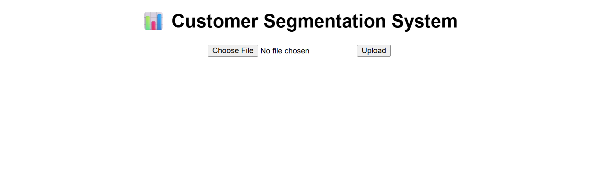
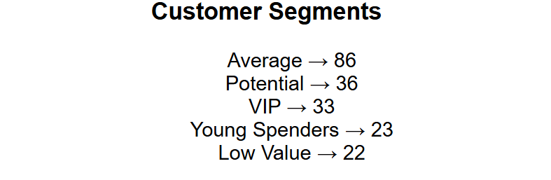
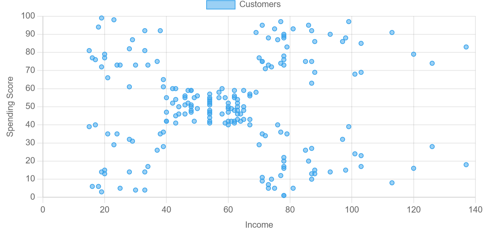

# 📊 Customer Segmentation & Business Insights System

## 🚀 Live Demo

👉 https://your-project-2-link.onrender.com

---

## 🚀 Overview

This project is a **Machine Learning-based web application** that segments customers into different groups based on their behavior.

It helps businesses:

* Understand customer types
* Target the right audience
* Improve marketing strategies

---

## 🎯 Features

### 🔹 1. Customer Segmentation

* Uses **KMeans Clustering**
* Groups customers into meaningful segments

---

### 🔹 2. Smart Business Labels

Customers are automatically categorized as:

* 💰 VIP Customers
* ⚠️ Potential Customers
* 🔵 Average Customers
* 🔴 Low Value Customers
* 🟣 Young Spenders

---

### 🔹 3. File Upload (CSV)

* Upload your own customer dataset
* System processes data instantly

---

### 🔹 4. Data Visualization 📈

* Scatter chart of:

  * Income vs Spending
* Easy to understand customer groups

---

### 🔹 5. Business Insights 📊

* Shows number of customers in each segment
* Helps decision-making

---

## 🛠 Technologies Used

* Python
* Flask
* Pandas
* Scikit-learn (KMeans)
* Chart.js
* HTML

---

## 🤖 Machine Learning Model

* Model: **KMeans Clustering**
* Input Features:

  * Annual Income
  * Spending Score
* Output:

  * Customer segments (clusters)

---

## 📁 Project Structure

```id="t9y3ps"
customer-segmentation/
│
├── app.py
├── model.py
├── requirements.txt
└── templates/
    └── index.html
```

---

## ▶️ How to Run Locally

```id="1c7p2r"
git clone <your-repo-link>
cd customer-segmentation
pip install -r requirements.txt
python app.py
```

---

## 📄 CSV Format

```id="x4gmqp"
CustomerID,Gender,Age,Annual Income (k$),Spending Score (1-100)
1,Male,19,15,39
2,Male,21,15,81
```

---

## ⚠️ Limitations

* Fixed number of clusters (5)
* Basic UI
* No user authentication

---

## 🔮 Future Improvements

* Dynamic cluster selection (Elbow method UI)
* Dashboard with advanced analytics
* Save user sessions
* Deployment scaling

---

## 💰 Business Value

This system helps:

* Identify high-value customers
* Improve marketing targeting
* Increase sales efficiency

---

## 👨‍💻 Author

* Built as a real-world ML project
* Focused on business problem solving

---

## ⭐ Final Note

This project demonstrates:

* Unsupervised Machine Learning
* Data analysis + business thinking
* Full-stack ML deployment

---
## 📸 Screenshots

### 🏠 Home Page



---

### 📊 Segmentation Result



---

### 📈 Customer Chart


